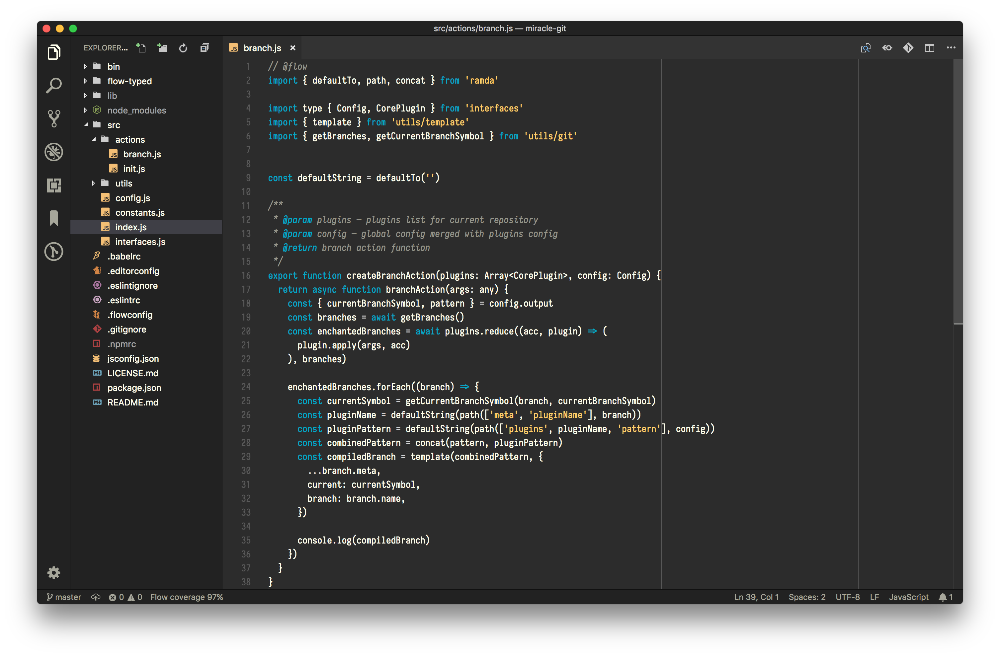

# Mercury

Minimalistic VS Code theme.

[](https://marketplace.visualstudio.com/items?itemName=yarastqt.mercury)

**Note: support for languages other than JavaScript is pretty much non-existent right now.**



## Override theme colors

You can override colors by adding these theme-specific settings to your configuration. For advanced customisation please check the [relative section on the vs code documentation](https://code.visualstudio.com/docs/getstarted/themes#_customizing-a-color-theme).

### Color Scheme override

```json
"editor.tokenColorCustomizations": {
  "[Mercury]": {
    "textMateRules": [
      {
        "scope": [
          "constant.numeric"
        ],
        "settings": {
          "foreground": "#fff"
        }
      }
    ]
  }
}
```

### UI Overrides

```json
"workbench.colorCustomizations": {
  "[Mercury]": {
    "sideBar.background": "#777"
  }
}
```

## License
Mercury is [MIT licensed](https://github.com/yarastqt/mercury/blob/master/LICENSE.md).
